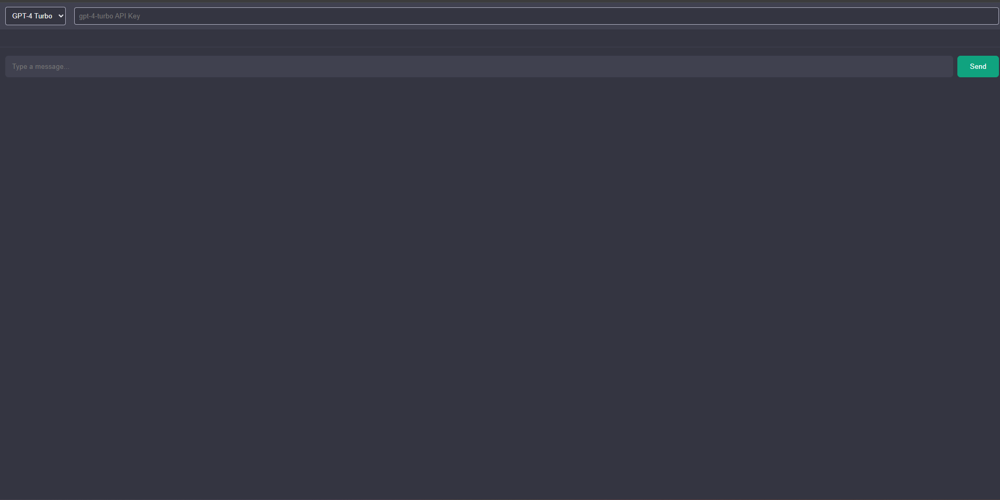

# API-Chat: En Desktop AI-klient

> API-Chat er en ren og minimalistisk desktop-applikasjon bygget med Electron og React, designet for å være et sentralt grensesnitt for å interagere med ulike store språkmodeller (LLMs) direkte fra skrivebordet.

---

## Visuell Oversikt

Her er et øyeblikksbilde av applikasjonens grensesnitt:



---

## Om Prosjektet

Dette prosjektet ble startet for å løse et enkelt problem: behovet for ett enkelt, raskt og lokalt grensesnitt for å teste og bruke forskjellige AI-modeller uten å måtte bytte mellom ulike nettsider. Ved å bruke API-nøkler direkte, gir API-Chat en mer strømlinjeformet og "native" opplevelse.

**Prosjektstatus:** Dette er et aktivt prosjekt under utvikling. Fundamentet er lagt, med støtte for valg av modell, API-nøkkelhåndtering og en grunnleggende chat-funksjonalitet.

### Hovedfunksjoner (Implementert & Planlagt)
*   ✅ **Desktop-opplevelse:** Bygget med **Electron** for en "native" følelse på tvers av operativsystemer.
*   ✅ **Modell-velger:** Enkelt bytte mellom ulike AI-modeller som GPT-4, Gemini, Claude, etc. (Støtte for flere modeller er under utvikling).
*   ✅ **Sikker nøkkelhåndtering:** API-nøkler lagres lokalt i `localStorage`.
*   ✅ **Chat-historikk:** Alle samtaler lagres lokalt, slik at du kan fortsette der du slapp.
*   ✅ **Markdown & Kodesyntaks:** Meldinger rendres med full støtte for Markdown og "syntax highlighting" for kodeblokker.
*   🔄 **Streaming-støtte:** Viser svar fra AI-modellene i sanntid etter hvert som de genereres.

### Bygget Med (Teknologistack)
*   **App-rammeverk:** Electron
*   **Frontend:** React, TypeScript, Vite
*   **Styling:** Ren CSS (med CSS Modules-prinsipper)
*   **State Management:** Zustand
*   **Markdown Rendering:** `react-markdown` med `prism-react-renderer` for kodesyntaks.

---

## Komme i Gang

Slik kan du kjøre prosjektet lokalt for utvikling.

### Forutsetninger
*   Node.js (v18+)
*   npm eller yarn

### Installasjon & Kjøring
1.  **Klon repoet:**
    ```bash
    git clone https://github.com/dittnavn/api-chat.git
    ```
2.  **Installer avhengigheter:**
    ```bash
    npm install
    ```
3.  **Start utviklingsmiljøet:**
    Denne kommandoen starter både Vite-serveren og Electron-appen samtidig.
    ```bash
    npm run electron:dev
    ```
---

